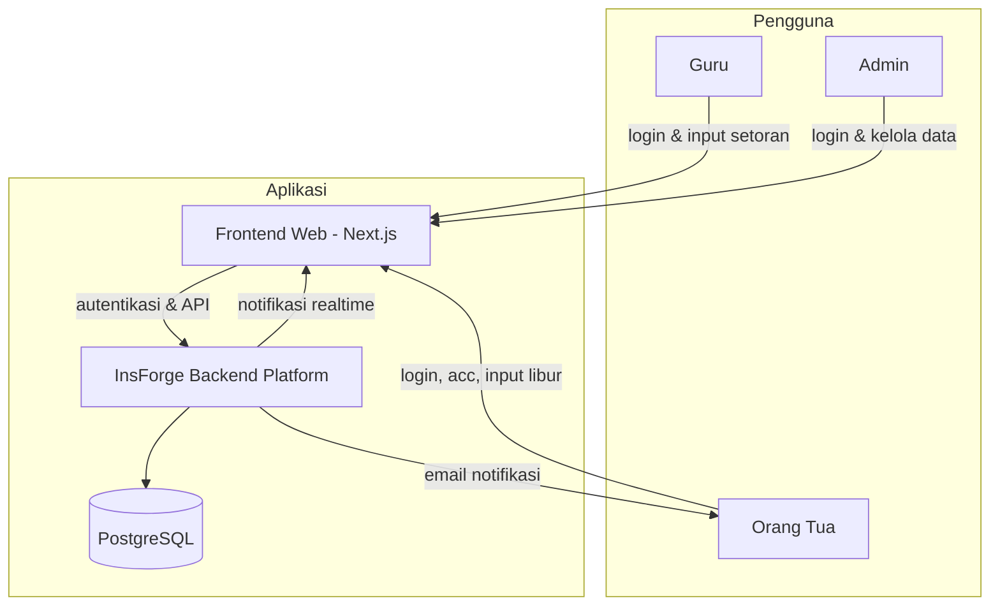
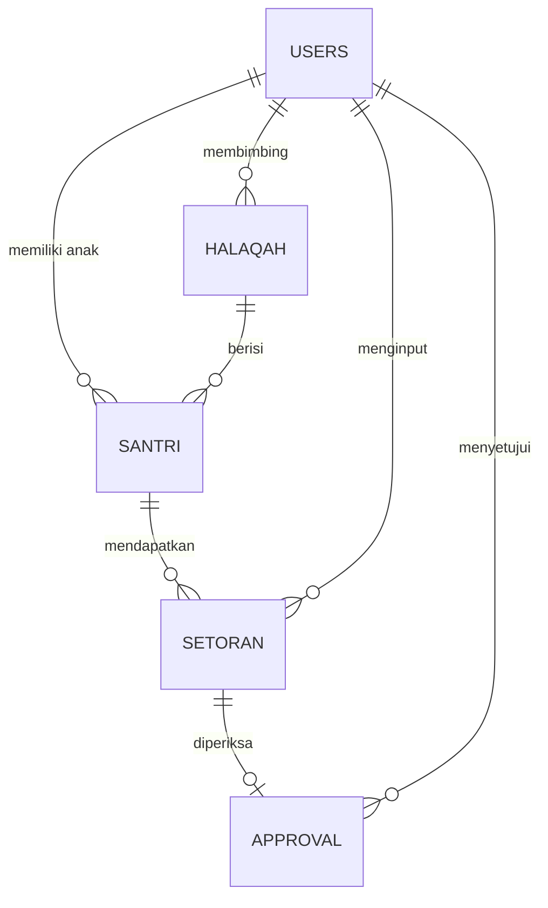

# PRD — Project Requirements Document

## 1. Overview

Masalah utama yang ingin diselesaikan adalah pencatatan capaian mengaji dan hafalan santri yang selama ini sering tidak terdokumentasi dengan baik, sehingga orang tua tidak mengetahui perkembangan anaknya secara jelas. Informasi setoran harian juga mudah hilang atau tidak tersampaikan antara guru pembimbing halaqah dan orang tua.

Aplikasi **Mutabaah Online** dibuat untuk menjadi sistem pencatatan harian yang terpusat. Guru dapat mencatat setoran mengaji dan hafalan santri dengan cepat, orang tua dapat memantau dan menyetujui capaian anaknya dari rumah, serta admin dapat mengelola seluruh data santri, guru, dan halaqah. Saat libur KBM, orang tua juga bisa menginput capaian mengaji dan hafalan anak dari rumah.

Tujuan utamanya adalah menciptakan transparansi dan keterpantauan capaian santri antara sekolah dan orang tua, sehingga proses pembinaan mengaji dan hafalan berjalan berkelanjutan meskipun tidak berada di lingkungan sekolah.

## 2. Requirements

- Aplikasi berbasis web yang bisa diakses melalui HP, tablet, dan komputer.
- Ada tiga peran pengguna: **Admin**, **Guru**, dan **Orang Tua**.
- Admin dapat mengelola data guru, santri, halaqah, dan melihat seluruh pengguna.
- Guru dapat menginput setoran mengaji dan hafalan santri setiap hari.
- Orang tua dapat melihat riwayat capaian, memberikan persetujuan atas setoran guru, dan menginput capaian saat libur.
- Sistem harus mencatat riwayat setoran secara lengkap agar bisa dilihat per hari, mingguan, maupun bulanan.
- Ada grafik progres hafalan untuk memudahkan orang tua dan guru melihat perkembangan santri.
- Sistem perlu memiliki autentikasi yang aman, termasuk login, pendaftaran akun, lupa password, dan logout.
- Tampilan harus sederhana dan mudah dipahami oleh pengguna non-teknis.

## 3. Core Features

### Fase 1 — Pencatatan Setoran Harian

- **Input Setoran Baru**  
  Guru dapat mengisi setoran mengaji atau hafalan santri dengan cepat melalui formulir sederhana.

- **Pilih Santri & Halaqah**  
  Sebelum menginput, guru memilih halaqah, santri, dan jenis setoran (mengaji atau hafalan).

- **Daftar Setoran Hari Ini**  
  Guru dapat melihat ringkasan semua setoran yang sudah diinput pada hari tersebut.

### Fase 2 — Riwayat, Persetujuan, dan Manajemen Data

#### Riwayat & Progres Capaian

- **Lihat Riwayat Setoran**  
  Guru dan orang tua dapat melihat daftar lengkap setoran harian santri secara kronologis.

- **Grafik Progres Hafalan**  
  Kemajuan hafalan santri ditampilkan dalam bentuk grafik agar mudah dipahami.

- **Ringkasan Capaian**  
  Sistem menyediakan rekap capaian harian, mingguan, atau bulanan untuk setiap santri.

#### Persetujuan Capaian

- **Notifikasi Menunggu Acc**  
  Orang tua mendapat daftar setoran yang perlu disetujui.

- **Setujui atau Tolak Setoran**  
  Orang tua dapat mengonfirmasi atau menolak setoran yang diinput oleh guru.

- **Riwayat Persetujuan**  
  Orang tua dapat melihat histori setoran yang sudah disetujui beserta statusnya.

#### Manajemen Data Santri & Guru

- **Tambah & Edit Santri**  
  Admin dapat menambah, mengedit, atau menonaktifkan data santri.

- **Tambah & Edit Guru**  
  Admin dapat mengelola akun dan data guru pembimbing.

- **Atur Halaqah**  
  Admin menghubungkan santri dan guru melalui kelompok halaqah.

- **Daftar Seluruh Pengguna**  
  Admin dapat melihat seluruh data santri, guru, dan orang tua yang terdaftar.

#### Input Mandiri Saat Libur

- **Form Setoran Libur**  
  Orang tua mencatat setoran mengaji dan hafalan anak selama libur sekolah.

- **Pilih Anak**  
  Orang tua memilih anak yang akan dicatat setorannya.

- **Riwayat Input Libur**  
  Orang tua dapat melihat kembali setoran liburan yang pernah diinput.

### Fase 3 — Autentikasi & Manajemen Akun

- **Login** — Masuk ke aplikasi dengan email dan kata sandi.
- **Daftar Akun** — Pendaftaran akun baru untuk guru, orang tua, atau admin.
- **Lupa Password** — Mereset kata sandi melalui tautan verifikasi.
- **Profil Saya** — Melihat dan mengubah informasi akun pribadi.
- **Logout** — Keluar dari aplikasi dengan aman.

## 4. User Flow

### Alur Admin

1. Admin login ke aplikasi.
2. Admin menambahkan data guru dan orang tua.
3. Admin menambahkan data santri.
4. Admin membuat kelompok halaqah dan menautkan santri ke guru pembimbing.
5. Admin memantau seluruh data pengguna dan setoran jika diperlukan.

### Alur Guru

1. Guru login.
2. Guru memilih halaqah yang dibimbing.
3. Guru memilih santri yang akan dicatat setorannya.
4. Guru mengisi jenis setoran, misalnya mengaji halaman tertentu atau hafalan surah.
5. Guru menyimpan setoran.
6. Guru melihat daftar setoran hari ini untuk memastikan semua santri sudah tercatat.

### Alur Orang Tua

1. Orang tua login.
2. Orang tua membuka notifikasi atau daftar setoran yang menunggu persetujuan.
3. Orang tua melihat detail capaian anak.
4. Orang tua menyetujui atau menolak setoran guru.
5. Orang tua membuka halaman riwayat untuk melihat perkembangan dan grafik hafalan anak.
6. Saat libur, orang tua memilih anak, mengisi setoran mengaji/hafalan, lalu menyimpannya.

## 5. Architecture

Aplikasi dibangun dengan arsitektur frontend dan backend yang terpisah. Frontend berkomunikasi dengan backend melalui API. Backend menangani autentikasi, penyimpanan data, notifikasi, dan logika bisnis.

Berikut gambaran arsitekturnya:

Penjelasan singkat:

- **Frontend** dibangun dengan Next.js dan digunakan oleh guru, orang tua, dan admin.
- **Backend** menggunakan InsForge sebagai satu platform yang menangani autentikasi, API, database, dan notifikasi.
- **Database** menggunakan PostgreSQL yang dikelola oleh InsForge untuk menyimpan semua data pengguna, halaqah, santri, dan setoran.
- **Realtime** dipakai untuk mengirim notifikasi ke orang tua ketika ada setoran baru yang menunggu persetujuan.
- **Email** digunakan untuk keperluan reset password dan notifikasi penting lainnya.

## 6. Database Schema

Rancangan database terdiri dari tabel utama: `users`, `halaqah`, `santri`, `setoran`, dan `approval`.

### Tabel dan Kolom

| Tabel | Kolom | Tipe | Kegunaan |
|---|---|---|---|
| **users** | id | UUID / PK | Identitas unik pengguna |
| | name | string | Nama lengkap |
| | email | string | Email login, unik |
| | password_hash | string | Kata sandi terenkripsi |
| | role | enum | Peran pengguna: `admin`, `guru`, `orang_tua` |
| | phone | string / nullable | Nomor kontak |
| | created_at | timestamp | Waktu akun dibuat |
| **halaqah** | id | UUID / PK | Identitas kelompok halaqah |
| | name | string | Nama halaqah |
| | teacher_id | UUID / FK | Guru pembimbing dari tabel `users` |
| | created_at | timestamp | Waktu dibuat |
| **santri** | id | UUID / PK | Identitas santri |
| | name | string | Nama santri |
| | nis | string | Nomor induk santri, unik |
| | halaqah_id | UUID / FK | Kelompok halaqah santri |
| | parent_id | UUID / FK | Orang tua dari tabel `users` |
| | status | enum | `aktif` atau `nonaktif` |
| | created_at | timestamp | Waktu data dibuat |
| **setoran** | id | UUID / PK | Identitas setoran |
| | santri_id | UUID / FK | Santri yang melakukan setoran |
| | input_by | UUID / FK | Pengguna yang menginput, bisa guru atau orang tua |
| | input_role | enum | Asal input: `guru` atau `orang_tua` |
| | type | enum | Jenis: `mengaji` atau `hafalan` |
| | description | text | Keterangan setoran, misal “Juz 1 hal 1–5” |
| | setoran_date | date | Tanggal setoran |
| | status | enum | `pending`, `disetujui`, `ditolak` |
| | created_at | timestamp | Waktu input |
| **approval** | id | UUID / PK | Identitas persetujuan |
| | setoran_id | UUID / FK | Setoran yang diperiksa |
| | parent_id | UUID / FK | Orang tua yang menyetujui |
| | status | enum | `disetujui` atau `ditolak` |
| | comment | text / nullable | Catatan orang tua |
| | created_at | timestamp | Waktu persetujuan |

### Diagram Hubungan Antar Tabel

## 7. Tech Stack

Rekomendasi teknologi untuk membangun aplikasi Mutabaah Online:

- **Frontend:** Next.js, Tailwind CSS, shadcn/ui
- **Backend & Platform:** InsForge  
  InsForge menyediakan layanan bawaan yang relevan, antara lain:
  - **PostgreSQL** sebagai database utama
  - **Authentication** untuk proses login, daftar akun, dan reset password
  - **Edge Functions** untuk menjalankan logika backend secara aman dan cepat
  - **Realtime** untuk notifikasi persetujuan secara langsung
  - **Email** untuk notifikasi dan verifikasi akun
  - **Storage** untuk menyimpan bukti setoran atau dokumen pendukung bila diperlukan di masa depan
- **Database:** PostgreSQL (dikelola oleh InsForge)
- **ORM:** Drizzle ORM
- **Authentication:** InsForge Auth
- **Deployment:** Vercel untuk frontend, InsForge untuk backend dan database